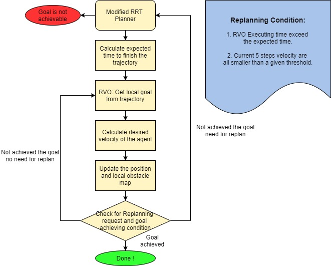
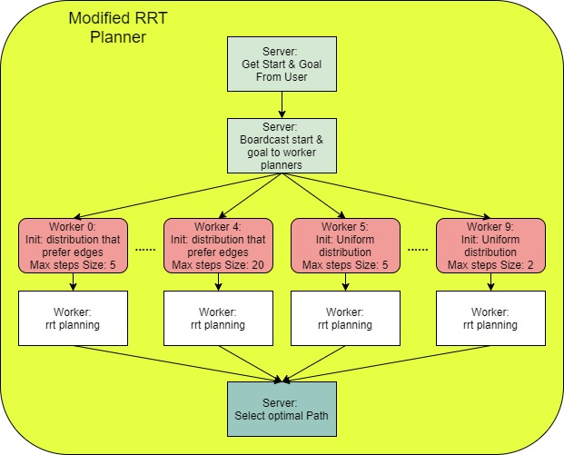
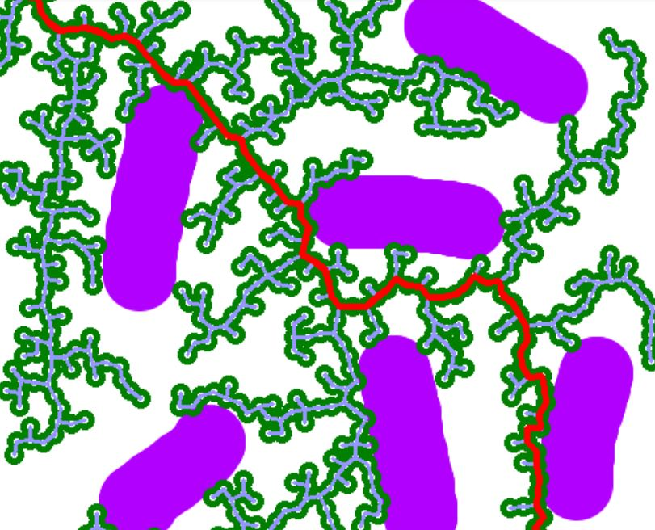
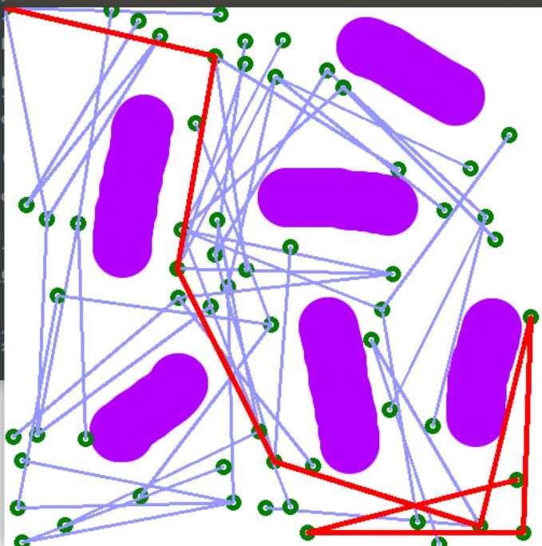
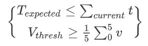
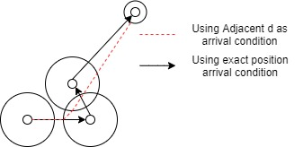

# 2D Omni Robot Navigation
**This repository belongs to HKU RoboMaster ICRA Challenge Team, serves as material for 2020 DJI ICRA AI Challenge.**


## Introduction
Efficient navigation in narrow space and facing multiple dynamic obstacles has always been a problem in robotics by the nature that the environment is often complex and onboard computational power is limited. 

There has been many attempts to tackle the problem from different perspectives. Traditional optimal planning method including A* and Dijkstra algorithm can guarantee an optimal solution but time the complexity in high dimension and resolution grid map is not realistic in small platform like wheeled robot. Probabilistic method has been invented by Lydia E. Kavraki and branched out to be probabilistic roadmap method and rapid exploring random tree(RRT). **These method accelerate the planning problem significantly in high dimensional configuration space.However,since these methods are only probabilisticly complete and doesn't guarantee optimal, naively apply these methods in motion planning problem is likely to fail when planning through narrow space or suffers from very wiggly trajectories.Heuristic Sampling around obstacle edges prefers narrow space planning, but tend to yield wiggly result in a more general map** 

Based on this observation  we combine the idea of parallel computation, heuristic sampling rrt and developed an frame work based on RRT and is able to plan efficiently under all kinds of maps and is able to plan trajectories even in very narrow space. To make the Navigation complete we further integrated and modified  Reciprocal Velocity Obstacle Avoidance(RVO),trick of conditional replanning in our frame work in order to avoid collision with other robots or dynamic obstacles.
## File Structure: Helper files
- local_rvo:
    - RVO: Main RVO updates and computation
    - vis: Visualize and simulate the process
- maps:
    - \<maps\>
    - \<probability maps\>
- conf.py: Hyperparameter setting
- extract_prob.py: Extract distribution from probability map
## Installation and testing
### Environment
- Ubuntu 18.04
- Intel Xeon E5-2600v4 x 2
### Dependency
```
sudo apt install mpich
pip install opecv-python matplotlib numpy mpi4py
```
### Usage
#### Isolated RVO test
```
python3 local_rvo_example.py
```
#### Isolated Original RRT test
```
python3 rrt_example.py <icra_new/narrow>
```
#### Isolated Our RRT test
```
mpiexec -n 10 python3 bias_rrt_example.py <icra_new/narrow>
```
#### Navigation Fully functional test
```
mpiexec -n 10 python3 main.py icra_new
```
- Select a start point on the displayed map.
- Select a goal point on the displayed map.
#### Prepare your own map
- Create grid map
    - Create Grid map using whatever tool you like Using Black to denote occupied
    - save in `maps` as \<name\>.bmp
- Create Probabilistic distribution map
    - Copy previous map, using gray color (intensity: 40 - 250) to draw the place higher probability is prefered.
    - save in `maps` as \<name\>prob.bmp
- Create distribution file:
    - `python3 extract_prob.py <name>prob`
    - A npy file named `<name>prob.npy` will exist.
- Create obstacle file and inflated map for Navigation fully functional test:
    - Under development, currently you can try on `icra_new`, the given case.


## Explanation and Flow Chart
1. General Work Flow:



2. Planner Parallel Logic:



- Noticed That the optimal trajectory can contain multiple criteria:
    - Shortest.
    - Less cumulative stiring angle.
    - Customized criteria.
- Since we are considering the Omni robot, which dynamic constraint is not significant in low speed case, we only choose shortest path.

## Design Rationale
### Scalable Parallel RRT with multiple distribution assumption
1. Rapid Exploring Random Tree is a probablistic motion planning algorithm which has time complexity O(n) when n is the maximum sampling number. However, its objective is to find a feasible path instead of a optimal one. Also, this algorithm is only probabilistic complete.
2. For different possible path pattern the sampling distribution assumption might differ, for example, when navigating in narrow space, sampling around the edge of obstacles is more efficient and often yield better outcome and when navigating in free space with sparse obstacles, random uniform sampling tends to perform better. In AI challenge map, since path depends on task and both of the above situation will occur multi-distribution assumptions are required.
3. Naively implement RRT has another drawback: Since the maximum step size for a given RRT is fixed, the algorithm tends to suffers from scaling problem with respect to the **ground truth optimal path length**. For distant goals, the optimal step size tends to be larger for faster performance and less wiggly path shape. For close goals, the optimal step size tends to be smaller for flexibility and to prevent overshoot.
However, since ground truth best path length is not directly measurable. Using multiple steps size assumption can be applicable to tackle the scaling problem.

<p align="center"></p>  
<p align="center">Small steps size need more point and tend to be wiggly</p>  
<p align="center"></p>  
<p align="center">Big steps size tend to overshoot</p>  

4. For different assumptions, we parallel the process by using MPI, which significantly speed up the speed of the algorithm.

### Local Reciprocal Velocity Obstacles Avoidance with replanning
1. RVO is a real time dynamic and static obstacle avoidance control policy desiged for large number multi-agent system, it shows significant performance and robustness in simulating large number of agents in symmetric environment with few static obstacles.However, as the shape and number of symmetric obstacles varies, the algorithm usually fall into sub optimal solution and some agent will be to halted.
2. Since our design is hierarchical in nature, the main purpose of RVO is to avoid dynamic obstacles as well as local static obstacles which haven't been planned to avoid by global planner due to the noisy localization, instead of distant obstacles which has been planned by global planner. Using the entire map as the sensing field for RVO is neither computationally efficient nor friendly to the RVO control.We use local sensing field for RVO, which pratically performs much better than global RVO.
3. Since the map's dynamic nature, purely use the initial planning result from beginning to the end regardless of the changing of the map is unfeasible and inefficient, we also check for the replanning condition by comparing the expected time of arrival and current time cost on this trajectory and recent speed of robot as listed below:

<p align="center"></p>

4. Loose arrival condition: since the localization is noisy in nature and the global planner might still yield wiggly path, we determine whether a robot has reached a waypoint by checking d adjacency. This method can be consider as a smooth filter for RRT planned path.




## Hyperparameters tuning tips

**`main.py` Hyperparams are defined in `conf.py`; `rrt_example.py`, and `bias_rrt.py` they are defined at the beginning of the file**

- `THRESH`: Threshold for local and remote area:
    - The larger the value is , the smoother the robot actual trajectory might be
    - Take longer time to compute
    - More bias might it be w.r.t. planned trajectory.
    - Recommanded range: [0.3-0.8]
- `MIN_NUM_VERT`: The minimum number of vertices to construct the path.
    - The larger the value is, the smoother the trajectory might be
    - The smaller the value is, the fast the algorithm might be.
    - Recommanded range: [5,20]
- `MAX_NUM_VERT`:The minimum number of vertices to construct the path.
    - Larger the value , slower the algorithm but more flexible in narrow space planning
    - Smaller the value, faster the algorithm but more likely to fail in narrow space planning.
    - Recommanded range: [1500 - 5000] for icra_new and [3000 - 7000] for narrow planning

## References
### Open Source Code
> https://github.com/MengGuo/RVO_Py_MAS

> https://github.com/ArianJM/rapidly-exploring-random-trees
### Papers:
> Haitao, G., Qingbao, Z., & Shoujiang, X. (2007). Rapid-exploring random tree algorithm for path planning of robot based on grid method. Journal of Nanjing Normal University (Engineering and Technology Edition), 2, 58-61.

> Islam, F., Nasir, J., Malik, U., Ayaz, Y., & Hasan, O. (2012, August). Rrt∗-smart: Rapid convergence implementation of rrt∗ towards optimal solution. In 2012 IEEE International Conference on Mechatronics and Automation (pp. 1651-1656). IEEE.

> Van den Berg, J., Lin, M., & Manocha, D. (2008, May). Reciprocal velocity obstacles for real-time multi-agent navigation. In 2008 IEEE International Conference on Robotics and Automation (pp. 1928-1935). IEEE.
