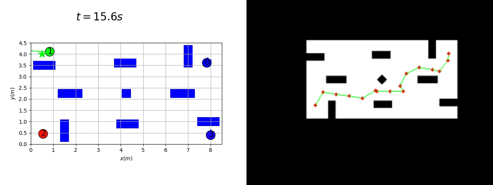

# 2D Omni Robot Navigation
**This repository belongs to HKU RoboMaster ICRA Challenge Team, serves as material for 2020 DJI ICRA AI Challenge.**

## Introduction
Efficient navigation in narrow space and facing multiple dynamic obstacles has always been a problem in robotics by the nature that the environment is often complex and onboard computational power is limited. 

There has been many attempts to tackle the problem from different perspectives. Traditional optimal planning method including A* and Dijkstra algorithm can guarantee an optimal solution but time the complexity in high dimension and resolution grid map is not realistic in small platform like wheeled robot. Probabilistic method has been invented by Lydia E. Kavraki and branched out to be probabilistic roadmap method and rapid exploring random tree(RRT). **These method accelerate the planning problem significantly in high dimensional configuration space.However,since these methods are only probabilisticly complete and doesn't guarantee optimal, naively apply these methods in motion planning problem is likely to fail when planning through narrow space or suffers from very wiggly trajectories.Heuristic Sampling around obstacle edges prefers narrow space planning, but tend to yield wiggly result in a more general map** 

Based on this observation  we combine the idea of parallel computation, heuristic sampling rrt and developed an frame work based on RRT and is able to plan efficiently under all kinds of maps and is able to plan trajectories even in very narrow space. To make the Navigation complete we further integrated and modified  Reciprocal Velocity Obstacle Avoidance(RVO),trick of conditional replanning in our frame work in order to avoid collision with other robots or dynamic obstacles.
## Installation and testing
### Environment
- Ubuntu 18.04
- Intel Xeon E5-2600v4 x 2
### Dependency
```
sudo apt install mpich
pip install opecv-python matplotlib numpy mpi4py
```
### Usage
#### Isolated RVO test
```
python3 local_rvo_example.py
```
#### Isolated Original RRT test
```
python3 rrt_example.py <icra_new/narrow>
```
#### Isolated Our RRT test
```
mpiexec -n 10 python3 bias_rrt_example.py <icra_new/narrow>
```
#### Navigation Fully functional test
```
mpiexec -n 10 python3 main.py icra_new
```
- Select a start point on the displayed map.
- Select a goal point on the displayed map.
#### Prepare your own map
- Create grid map
    - Create Grid map using whatever tool you like Using Black to denote occupied
    - save in `maps` as \<name\>.bmp
- Create Probabilistic distribution map
    - Copy previous map, using gray color (intensity: 40 - 250) to draw the place higher probability is prefered.
    - save in `maps` as \<name\>prob.bmp
- Create distribution file:
    - `python3 extract_prob.py <name>prob`
    - A npy file named `<name>prob.npy` will exist.
- Create obstacle file and inflated map for Navigation fully functional test:
    - Under development, currently you can try on `icra_new`, the given case.


## Explanation and Flow Chart
1. General Work Flow:


2. Planner Parallel Logic:


- Noticed That the optimal trajectory can contain multiple criteria:
    - Shortest.
    - Less cumulative stiring angle.
    - Customized criteria.
- Since we are considering the Omni robot, which dynamic constraint is not significant in low speed case, we only choose shortest path.

## Hyperparameters tuning tips

**`main.py` Hyperparams are defined in `conf.py`; `rrt_example.py`, and `bias_rrt.py` they are defined at the beginning of the file**

- `THRESH`: Threshold for local and remote area:
    - The larger the value is , the smoother the robot actual trajectory might be
    - Take longer time to compute
    - More bias might it be w.r.t. planned trajectory.
    - Recommanded range: [0.3-0.8]
- `MIN_NUM_VERT`: The minimum number of vertices to construct the path.
    - The larger the value is, the smoother the trajectory might be
    - The smaller the value is, the fast the algorithm might be.
    - Recommanded range: [5,20]
- `MAX_NUM_VERT`:The minimum number of vertices to construct the path.
    - Larger the value , slower the algorithm but more flexible in narrow space planning
    - Smaller the value, faster the algorithm but more likely to fail in narrow space planning.
    - Recommanded range: [1500 - 5000] for icra_new and [3000 - 7000] for narrow planning

